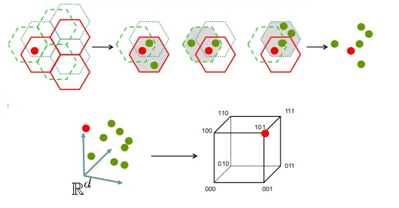

# Locality Sensitive Hashing - Hypercube
<p align="center">
  
</p>
<br />Implementation of Locality-sensitive hashing (LSH) and Hypercube algorithm for finding Approximate Nearest Neighbours in d-space, using the Euclidean Distance and Cosine Similarity Metrics. At first a list of vector is read and put in LSH or Hypercube hash tables. Then a list of vectors is analyzed in order to find approximate nearest neighbours, within a radius defined. More info about LSH and Hypercube here: 
<br />https://www.en.wikipedia.org/wiki/Locality-sensitive_hashing
<br />https://arxiv.org/abs/1702.05760.

## Deployment

The code was developed and tested on **Linux Ubuntu 18.04 LTS** using **C++11** and **g++ v7.3.0**.

## Prerequisites

A Linux distribution is required with a g++ compiler order to compile and execute. _g++ v7.3.0_ is recommended.
<br />You can check your gcc compiler version using:
<br />``` $ g++ --version ```

You can install the latest gcc compiler on Ubuntu based systems using:
<br />``` $ sudo apt install build-essential ``` 

## Getting Started
Download Repository Locally using:
<br /> ```$ git clone https://github.com/AndCharalampous/lsh.git ```

## Compilation
Compile code using the Makefile provided:
<br /> ```$ cd src/WebServer```
* LSH: ```$ make lsh```
<br /> Executable file lsh is created.
* Hypercube:```$ make hypercube```
<br /> Executable file hypercube is created.

### Execution
* LSH: Execute using:
<br /> ```$ ./lsh [-d input_file] [-q query_file] [-o output_file] [-k K] [-L L]```
<br />input_file: Path to dataset train file
<br />query_file: Path to file containing query vectors
<br />output_file: Path to results file
<br />K: Number of LSH Hash Functions
<br />L: Number of LSH Hash Tables
<br />_All parameters are optional during executing. If not provided, the three files will be requested from user. The K and L parameter if not provided, the default values will be used._
* Hypercube: Execute using:
<br /> ```./hypercube [-d input_file] [-q query_file] [-o output_file] [-k K] [-probes P] [-M m]```
<br />input_file: Path to dataset train file
<br />query_file: Path to file containing query vectors
<br />output_file: Path to results file
<br />K: Number of LSH Hash Functions
<br />P: Maximum number of neighbour edges checked
<br />M: Maximum number of vectors checked during search
<br />_All parameters are optional during executing. If not provided, the three files will be requested from user. The K, probes and M parameter if not provided, the default values will be used._

### Output
* **LSH**:
<br />LSH USING COSINE SIMILARITY
<br />===========================
<br />
<br />
<br />Query: item_idS0
<br />R-near neighbours (R = 1):
<br />  item_id25
<br />  item_id42
<br />  ...
<br />  ...
<br />  item_id9941
<br />Nearest Neighbour: item_id2176
<br />DistanceLSH: 0.148192
<br />DistanceTrue: 0.148192
<br />timeLSH: 0.024366
<br />timeReal: 0.037003
<br />...
<br />...

* **Hypercube**:
<br />HYPERCUBE USING COSINE SIMILARITY
<br />=================================
<br />
<br />
<br />Query: item_idS0
<br />R-near neighbours (R = 1):
<br />  item_id0
<br />  item_id2
<br />  ...
<br />  ...
<br />  item_id37
<br />Nearest Neighbour: item_id25
<br />DistanceHC: 0.308574
<br />DistanceTrue: 0.148192
<br />timeHC: 7.3e-05
<br />timeReal: 0.036323

## Author
**Andreas Charalampous** - https://github.com/AndCharalampous

## License

This project is licensed under the MIT License - see the [LICENSE.md](LICENSE.md) file for details
